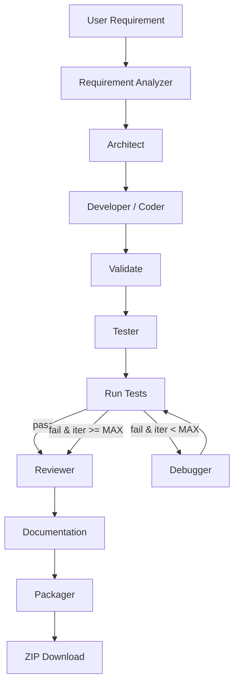

# DevTeam AI – Multi-Agent AI Software Engineering Workspace

DevTeam AI is a multi-agent, AI software-engineering platform that generates
complete, professional full-stack projects from a single text prompt. A
LangGraph pipeline orchestrates specialized agents (Architect, Developer,
Tester, Debugger, Reviewer, Documentation) that plan, generate, validate,
fix, review and package source code. It is designed as a resume-level POC:
cost-aware, iterative, and easy to reconfigure.

**Forge** is the interactive AI software engineer at the center of the
workspace: it understands a request, generates code, runs commands through a
controlled tool layer, and pauses for your approval before executing anything
risky — then keeps going until the project builds and tests pass.

## Features

- **Multi-Agent Architecture** — a stateful LangGraph workflow with an iterative test → debug loop.
- **Model Routing** — different (low-cost / free) OpenRouter models per task type, all behind a single `get_llm()` factory.
- **Deterministic Validation** — `py_compile` + `pytest` run locally to catch failures *before* spending LLM tokens on fixes.
- **Tool Layer** — sandboxed file and test operations (`read_file`, `write_file`, `edit_file`, `list_files`, `search_files`, `run_tests`, `inspect_errors`, `run_command`, `git_status`, `git_diff`).
- **Forge Interactive Loop** — Forge runs commands via the tool layer and pauses the LangGraph graph (`interrupt`) for human approval of risky commands; results return to the graph so Forge can react.
- **Command Safety Policy** — every command is classified SAFE / APPROVAL_REQUIRED / BLOCKED (structured parsing, not substring matching) with workspace-escape and path-traversal protection.
- **Human-in-the-Loop Approval** — real Streamlit controls (Allow once / Allow session / Deny) resume the graph via `Command(resume=...)`.
- **Terminal Cards in Chat** — command execution appears as compact, expandable terminal cards *inside* the Forge conversation (no permanent bottom terminal).
- **FastAPI backend** — separate REST API for generation, status, files, preview and download.
- **Exporting** — download the generated source code as a ZIP package.

## Tech Stack

| Layer | Technology |
| --- | --- |
| Frontend | Streamlit (two-panel workspace) |
| Backend | FastAPI + Uvicorn |
| Orchestration | LangGraph |
| LLM | OpenRouter (OpenAI-compatible) via LangChain `ChatOpenAI` |
| Validation | `py_compile` + `pytest` (deterministic, local) |
| Config | `.env` + environment variables |

## Agent Workflow



The agents in the pipeline:

1. **Requirement Analyzer** — extracts features, app type and tech stack.
2. **Architect** — designs project structure, modules, dependencies.
3. **Developer / Coder** — generates all source code files.
4. **Validator** — deterministic structural check (non-empty, parses).
5. **Tester** — generates unit/integration tests.
6. **Run Tests** — runs `py_compile` + `pytest` in a sandboxed temp copy.
7. **Debugger** — on failure, receives the error report and regenerates fixes (up to `MAX_AGENT_ITERATIONS`).
8. **Reviewer** — reviews the final code for quality.
9. **Documentation** — writes README and setup docs.
10. **Packager** — writes files to disk and builds a downloadable ZIP.

## Forge — Interactive AI Software Engineer

Forge turns DevTeam AI from a one-shot generator into an interactive
software-engineering workspace. The core loop is:

```
User -> Forge -> LangGraph -> Tools -> Project -> Tool result -> Forge -> next action
```

### How it works

1. You send a prompt in the **Forge** chat (right panel).
2. The LangGraph pipeline runs (Requirement Analyzer -> Architect -> Developer ->
   Validate -> Tester).
3. Forge requests a command (e.g. `python -m pytest`) via `run_command`.
4. The **command policy** classifies it. If approval is required, the graph
   pauses with `interrupt()` and an interactive card appears in the chat.
5. You choose **Allow once**, **Allow session** (caches the command signature),
   or **Deny**. The graph resumes with `Command(resume=...)`.
6. The command executes (no shell — `subprocess` with `shlex`, sandboxed to the
   project workspace) and a **terminal card** (command, stdout, stderr, exit
   code, duration, approval state) is added to the conversation.
7. If tests fail, the **Debugger** fixes the code and the tests re-run, bounded
   by `MAX_AGENT_ITERATIONS`. Then Reviewer -> Documentation -> Packager.

### Command safety policy

| Risk | Examples | Behavior |
| --- | --- | --- |
| `SAFE` | `pytest`, `python -m pytest`, `python -m py_compile`, `git status`, `git diff`, `npm test`, `npm run build`, linters, version checks | Auto-run (toggle with *Auto-approve safe commands*) |
| `APPROVAL_REQUIRED` | `pip install`, `npm install`, `git commit`, `git push`, `git checkout`, dev servers, unknown programs | Pause -> ask the user |
| `BLOCKED` | `rm -rf`, `sudo`, `mkfs`, `dd`, `curl`/`wget`, `env`/`printenv`, `~/.ssh`, `.env`, `/etc/*`, `../../` traversal, absolute paths outside the workspace | Never executed |

Classification is structural (`shlex`-parsed program + subcommand), not naive
substring matching. Working directories and command arguments are validated
against the project root to prevent path traversal and workspace escape.
Commands never run through a shell, which prevents shell injection.

> **Reconciliation note:** the spec lists `pytest` as SAFE but the UX examples
> show an approval prompt for it. By default the Streamlit *Auto-approve safe
> commands* checkbox is **off**, so even safe commands ask once (demonstrating
> the human-in-the-loop); "Allow session" then caches them. Tick the checkbox
> to auto-run safe commands without prompting.

### Security

- Forge only operates inside the designated project workspace (`generated_projects/<run_id>`).
- `OPENROUTER_API_KEY` and environment secrets are never exposed; `.env`,
  `~/.ssh`, `~/.aws`, and credential files are blocked.
- Path traversal (`../`), absolute system paths, and workspace escapes are
  rejected by `ProjectTools._safe_path` and the command policy.
- No `os.system`; commands run with `subprocess.run(shell=False)`.

## OpenRouter Configuration

DevTeam AI uses [OpenRouter](https://openrouter.ai)'s OpenAI-compatible API.
All LLM access goes through the centralized factory in
[`config/llm_config.py`](config/llm_config.py) (`get_llm()` / `generate_response()`),
so agents never depend on the provider directly and changing the model later
only touches configuration — not every agent.

### Environment variables

| Variable | Required | Description |
| --- | --- | --- |
| `OPENROUTER_API_KEY` | ✅ | Your OpenRouter API key |
| `OPENROUTER_BASE_URL` | – | OpenAI-compatible endpoint (default `https://openrouter.ai/api/v1`) |
| `OPENROUTER_MODEL` | – | Default / fallback model |
| `OPENROUTER_MODEL_DEFAULT` | – | Default model (alias) |
| `OPENROUTER_MODEL_CODING` | – | Model for coding/debugging/review tasks |
| `OPENROUTER_MODEL_REASONING` | – | Model for planning/architecture tasks |
| `OPENROUTER_MODEL_FAST` | – | Model for lightweight/fast tasks |
| `MAX_AGENT_ITERATIONS` | – | Max debug iterations before giving up (default `3`) |

Any task-specific model that is unset falls back to the default model, so the
app runs with a single model configured. The defaults target low-cost/free
models available on OpenRouter.

Copy `.env.example` to `.env` and fill in your key:

```bash
cp .env.example .env
```

```env
OPENROUTER_API_KEY=sk-or-v1-...
OPENROUTER_MODEL=meta-llama/llama-3.3-70b-instruct:free
MAX_AGENT_ITERATIONS=3
```

> **Never hard-code or commit your API key.** The key is read from the
> environment / Streamlit Secrets and is never exposed in the UI.

## Local Setup

1. **Clone & install dependencies**

   ```bash
   pip install -r requirements.txt
   ```

2. **Configure environment**

   ```bash
   cp .env.example .env
   # edit .env and add your OPENROUTER_API_KEY
   ```

3. **Run the Streamlit workspace**

   ```bash
   streamlit run app.py
   ```

4. **(Optional) Run the FastAPI backend**

   ```bash
   python -m uvicorn app.main:app --host 0.0.0.0 --port 8000 --reload
   ```
   Then open `http://localhost:8000` for the HTML dashboard, or use the REST API.

## Example Usage

1. Open the Streamlit app.
2. Enter a prompt, e.g.:
   > Build a REST API for a todo app in Python FastAPI with SQLite and unit tests.
3. Click **Generate Project ✨**.
4. Watch the agent pills light up as each agent runs; the terminal shows logs
   and test results.
5. Browse generated files in the left explorer and download the ZIP.

## Project Structure

```
DevTeam-AI-main/
├── app.py                  # Streamlit two-panel workspace UI
├── requirements.txt        # Python dependencies
├── .env.example            # Environment configuration template
├── agents/                 # LLM agents (one per role)
│   ├── requirement_agent.py
│   ├── architect_agent.py
│   ├── coder_agent.py
│   ├── reviewer_agent.py
│   ├── debugger_agent.py
│   ├── tester_agent.py
│   ├── documentation_agent.py
│   ├── packager_agent.py
│   └── forge_agent.py       # Forge voice + wrap-up summary
├── config/
│   └── llm_config.py        # Central LLM factory + model routing
├── workflows/
│   └── graph.py             # LangGraph state machine + interrupt HITL
├── services/
│   ├── project_service.py  # FastAPI run lifecycle (non-interactive)
│   ├── tools.py             # Sandboxed file/test/command tool layer
│   └── command_policy.py   # Command safety classification
├── routes/
│   └── api.py               # FastAPI REST endpoints
├── app/
│   └── main.py              # FastAPI app (HTML dashboard + API)
├── utils/
│   └── json_parser.py       # Robust JSON extraction from LLM output
├── templates/               # FastAPI HTML dashboard
├── static/                  # FastAPI static assets
└── generated_projects/      # Output directory (files + ZIPs)
```

## API Documentation

| Method | Endpoint | Description |
| --- | --- | --- |
| `POST` | `/generate` | Start a new project generation run |
| `GET` | `/status/{run_id}` | Live status, current agent, logs, test results, usage |
| `GET` | `/files/{run_id}` | Generated files in JSON |
| `GET` | `/preview/{run_id}` | Code preview in JSON |
| `GET` | `/download/{run_id}` | Download the full source as a ZIP |
| `GET` | `/models` | Resolved model routing configuration |

## Cost Optimization

- Validation and test execution are **deterministic** (no LLM tokens).
- The Debugger only runs when something actually fails.
- Agents receive only relevant context (e.g. the Documentation agent gets file
  *paths*, not full contents).
- The debug loop is bounded by `MAX_AGENT_ITERATIONS`.
- The UI shows the number of agent calls and selected models.

## Limitations

- LLM-generated code may require manual fixes; the deterministic loop catches
  syntax/test failures but not deep logic bugs.
- Test execution runs `pytest` locally in a temp copy; projects needing extra
  dependencies may not fully run.
- This is a POC and stores run state in memory (not persisted).
